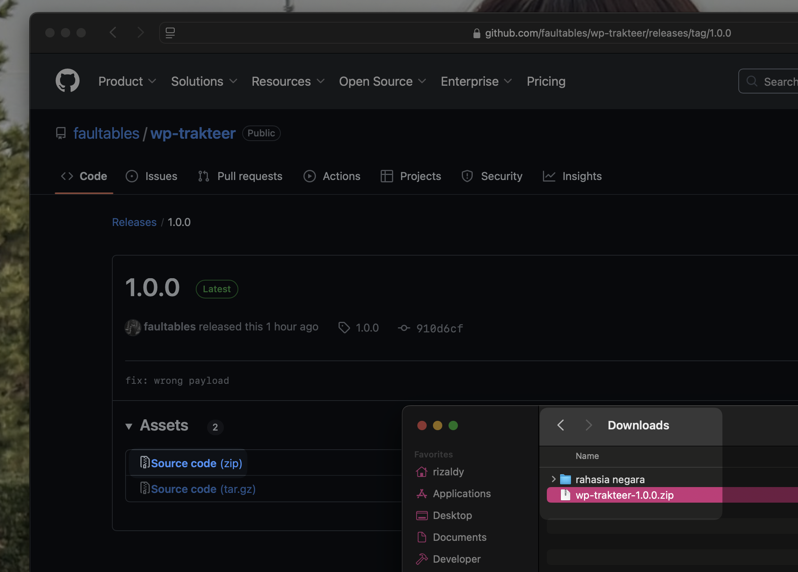
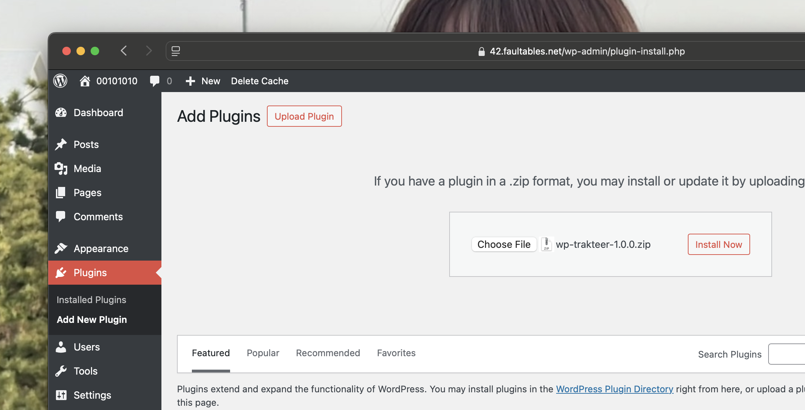
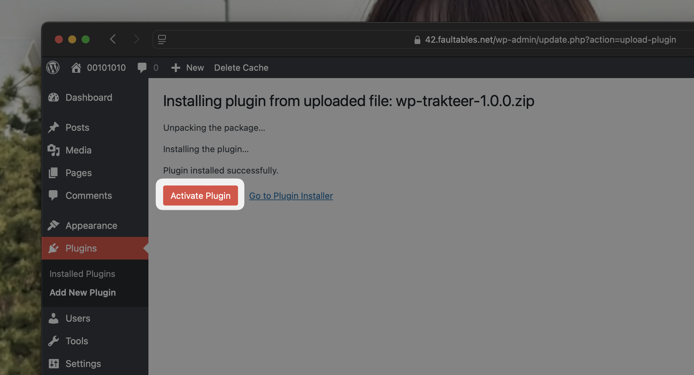
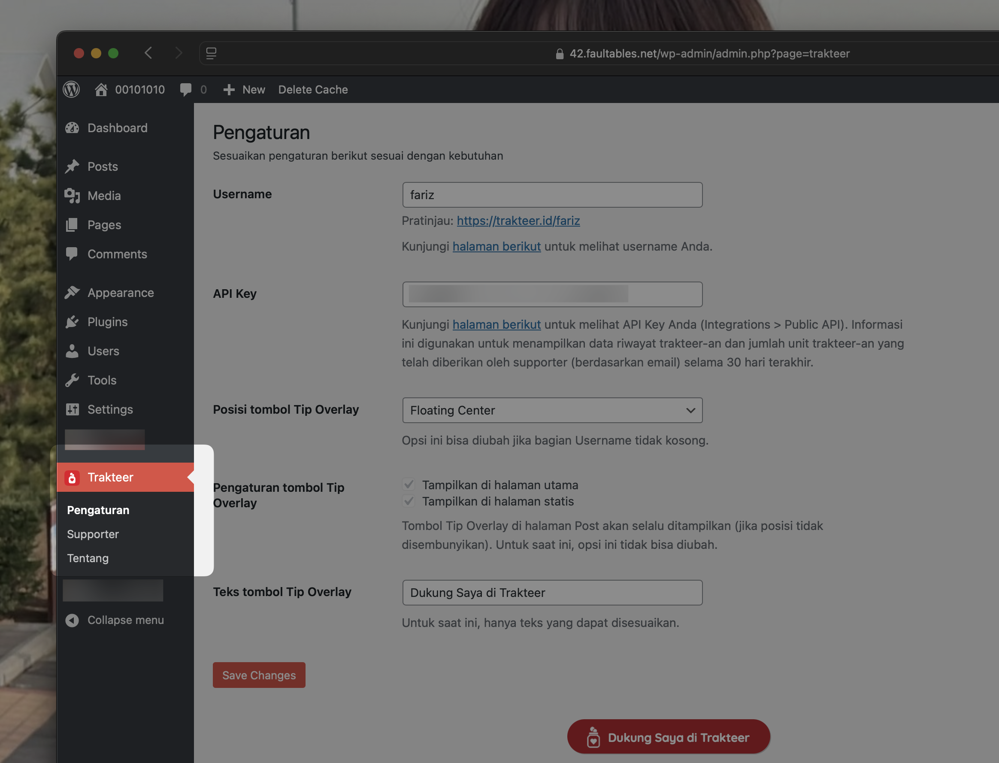

# Memperkenalkan wp-trakteer: Unofficial Trakteer Wordpress Plugin

> [!NOTE]
>
> Trakteer adalah merek dagang dari PT Apresiasi Karya Nusantara. Segala penggunaan oleh penulis hanya untuk tujuan referensi dan tidak menunjukkan adanya sponsor, dukungan, atau afiliasi antara PT Apresiasi Karya Nusantara dan penulis.
>
> Perlu diketahui bahwa penulis adalah bagian dari tim Trakteer per tulisan ini diterbitkan, namun segala referensi yang ada tidak terkait dengan pekerjaan penulis.

Meskipun format menulis favorit saya sampai saat ini adalah Markdown, namun Wordpress, saya rasa platform yang cukup spesial, sekalipun tidak menggunakan Markdown. Sebelumnya saya menulis menggunakan platform [Ghost](https://ghost.org/) dan saya sadar jika Wordpress ada. Wordpress, pada saat saya masih mengikuti perkembangannya, masih cukup sering mendapatkan kabar yang kurang bagus khususnya dalam security. Namun teknologi berkembang dan begitupula ekosistem & komunitas Wordpress. Lalu pada suatu hari, saya harus berpindah dari Ghost karena sistemnya yang kurang fleksibel, meskipun itu adalah fitur pembeda dari Ghost itu sendiri.

Sejak berpindah dari Ghost, sesekali saya menerbitkan tulisan di blog pribadi saya yang beralamat di [42.faultables.net](https://42.faultables.net). Dan, ya, blog tersebut ditenagai oleh Wordpress dan berjalan di server saya yang berada di rumah. Tidak semua tulisan yang ada di blog saya dapat dibaca oleh publik, dan itu sesuai dengan kebutuhan saya. Bahkan saya memblokir akses dari Search Engine seperti Google dalam meng-index blog saya tersebut agar blog saya tidak tampil di halaman pencarian. Untuk dapat membaca beberapa tulisan saya, melakukan "berlangganan" diperlukan. Dengan maksud, agar tulisan tersebut hanya bisa dibaca oleh mereka yang memang ingin membacanya dan yang memang menyukai tulisan-tulisan yang pernah saya terbitkan.

Alur untuk berlangganannya relatif ribet, per tulisan ini diterbitkan, kurang lebih seperti ini:

- Pengunjung mengakses tulisan
- Pengunjung mengakses halaman Trakteer saya dan mengakses judul dari tulisan saya di bagian "Community Post" di halaman Trakteer saya
- Konten di halaman Community Post tersebut hanya dapat dibaca oleh "supporter aktif" alias harus men-trakteer saya terlebih dahulu
- Jika sudah menjadi supporter aktif, konten di halaman Community Post tersebut akan bisa diakses dan berisi "password" yang akan digunakan untuk mengakses tulisan di blog saya
- Pengunjung kembali ke halaman yang ada di blog saya lalu memasukkan password tersebut

Tentu saja alur ini tidak ideal, tapi *somewhat* works, setidaknya untuk sekarang. Sejauh ini ada 3 pengunjung yang pernah melakukan cara tersebut, yang setidaknya, cukup membantu meyakinkan saya bahwa pendekatan tersebut bisa dilakukan.

## Public API

Sebelum saya bergabung dengan tim, saya sempat sesekali mendiskusikan fitur, yang salah satunya adalah Public API. Public API bukanlah komponen krusial dari sebuah aplikasi web, namun pada akhirnya akan dikembangkan juga khususnya jika klien sudah bukan hanya peramban lagi.

Terlebih, Public API adalah salah satu jalan untuk mengundang komunitas agar bisa membuat sesuatu di atas platform tersebut memungkinkan. Terlepas dari kreator yang menggunakan Trakteer, beberapa pengembang pun menggunakan Trakteer untuk dapat menerima dukungan, salah satunya dari pengguna yang menggunakan aplikasi yang mereka kembangkan tersebut. Beberapa aplikasi aktif yang saya tahu adalah [Ksana.in](https://ksana.in) (pemendek tautan) dan [TanyaAja](https://tanyaaja.in) (platform tanya-jawab secara anonim) yang dikembangkan oleh [pengembang](https://www.mazipan.space/support) yang sama.

Saya tidak ingat kapan Trakteer merilis Public API di production, dan per tulisan ini diterbitkan, setidaknya ada 4 endpoint yang dapat digunakan oleh pengembang:

- **Quantity Given** untuk melihat jumlah unit trakteer-an yang telah diberikan oleh supporter (berdasarkan email) selama 30 hari terakhir.
- **Support History** untuk mendapatkan riwayat trakteer-an yang diberikan oleh supporter.
- **Current Balance** untuk melihat jumlah saldo yang dimiliki.
- **Transaction History** untuk mendapatkan riwayat trakteer-an yang telah diberikan kepada kreator.

Endpoint di atas relatif dasar, namun cukup membantu.

To be fair, saya secara pribadi bukanlah penggemar konsep walled garden. Trakteer menawarkan fitur untuk membantu kreator dalam membuat dan mendistribusikan karyanya yang salah satunya melalui fitur Rewards (seperti tulisan ini) dan Shop. Fitur tersebut cukup membantu khususnya untuk kreator yang tidak memiliki preferensi lebih lanjut dalam pembuatan dan pendistribusian karyanya.

Namun bukan berarti kreator yang mendistribusikan karyanya secara mandiri harus menjadi warga negara kelas dua! Pendekatan yang saya gunakan di blog saya adalah solusi sementara karena saya belum terlalu familiar dengan sistem plugin di Wordpress dan khususnya dalam menulis kode PHP modern. Time flies, dan here we are. Bukan sebuah rahasia jika fondasi dari platform Trakteer ditulis menggunakan PHP dan itu cukup membantu saya juga khususnya dalam mengembangkan plugin ini :)

## Trakteer Wordpress Plugin

Untuk saat ini plugin ini bisa membantu mempermudah pemasangan [Tip Overlay](https://trakteer.id/manage/website-embeds) (with some goodies like "floating-center" :P) dan menampilkan data riwayat trakteer-an yang diberikan oleh supporter. Ini baru awal, in fact, versi 1.0.0 saya kembangkan setelah bangun tidur di hari Sabtu (hari yang sama dengan tulisan ini diterbitkan). Di versi selanjutnya, saya ingin membuat integrasi "member di Wordpress" dengan "supporter di Trakteer" yang mana berguna untuk kebutuhan di blog pribadi saya (meskipun adanya fitur OAuth akan lebih membantu HAHA).

Ada beberapa fitur lain di Trakteer yang mungkin dapat membuat plugin ini bisa menjadi lebih berguna lagi, seperti untuk Webhook. Namun saya belum memiliki kasus yang pas untuk fitur tersebut dan feel freeceritakan ide mu jika memiliki kasus tersebut. I'm all ears!

Untuk instalasi plugin ini relatif mudah, hanya butuh berkas archive (zip) lalu upload di situs Wordpress yang kamu gunakan. Idealnya, plugin Wordpress perlu dipublikasikan ke wordpress.org, khususnya agar mendapat dukungan auto update, tapi karena saya tidak memiliki akun w.org, dan plugin ini masih dalam early stage anyway, mari kita gunakan cara seperti ini saja untuk sementara waktu.

Caranya adalah, pertama, unduh berkas zip dari [GitHub](https://github.com/faultables/wp-trakteer/releases).

Masuk ke `Dashboard Wordpress > Plugins > Add New Plugin > Upload Plugin` lalu unggah berkas zip tersebut.

Klik **Install Now** dan tunggu beberapa detik. Setelah berhasil, aktivasi plugin dengan menekan tombol **Activate Plugin** dan plugin akan siap digunakan!

Setelah diaktifkan, menu "Trakteer" akan muncul di sidebar. Untuk membuat plugin bekerja, isi informasi berikut terlebih dahulu:

Dan plugin siap digunakan!

## Penutup

Plugin ini gratis & bersumber kode terbuka. Namun perlu diingat bahwa saya tidak memberikan jaminan terkait apapun yang berkaitan dengan plugin ini. Selebihnya bisa pelajari lebih lanjut dengan membaca lisensi yang digunakan oleh plugin ini, sebagai TL;DR: plugin ini aman digunakan dan tidak perlu mengkhawatirkan apapun yang sekiranya akan membatasi kebebasanmu dalam menerbitkan tulisan.

Jika memiliki pertanyaan atau kendala terkait plugin ini, silahkan gunakan [GitHub Issues](https://github.com/faultables/wp-trakteer/issues/new).

Salah satu alasan terkait kehadiran plugin ini adalah untuk mencoba membantu teman-teman blogger yang mendistribusikan tulisannya secara mandiri menggunakan Wordpress. Dan juga, untuk mengajak teman-teman pengembang untuk membantu, terkait bagaimana Trakteer sebagai platform dapat membantu aplikasi yang kamu kembangkan :)
